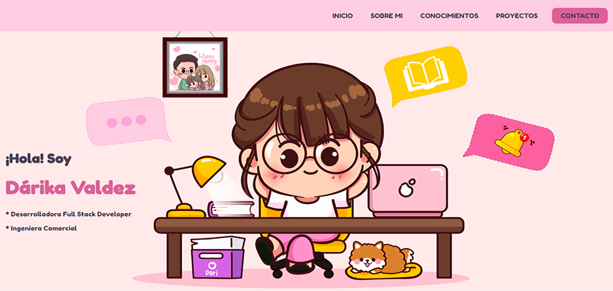

# Mi portfolio

👩‍💻 **¡Acá vas a encontrar mi primer proyecto!**

Se trata de una web que cuenta con información sobre mi recorrido programando. Lo desarrolle con:

• HTML

• CSS (Flexbox / Responsive)

• JavaScript

• Git

Fui realizando algunas mejoras y actualizaciones pero decidí conservarlo en las tecnologías iniciales para poder hacer un recorrido del crecimiento en el proceso de aprendizaje. 

Link a [Mi portfolio](https://darika-valdez.vercel.app/) 🏃‍♀️

#### Podrás ver:

• Herramientas y aprendizajes incorporados.

• Proyectos realizados durante el bootcamp en Henry.

• Proyectos personales.

• Formas de contacto.

• Y más!

---

### Me encuentro en busqueda activa laboral, idealmente, en un equipo de trabajo en Front End.

**💗¡Gracias por tu visita!💗**

Dari VD
