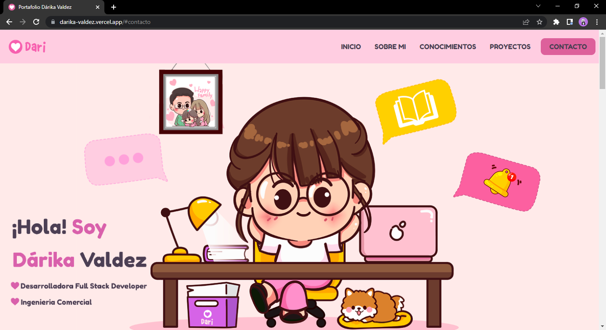

# Mi portfolio

👩‍💻 **¡Acá vas a encontrar mi primer proyecto!**

Se trata de una web que cuenta con información sobre mi recorrido programando. Lo desarrolle con:

• HTML

• CSS (Flexbox / Responsive)

• JavaScript

• Git

Con el correr de los meses fui realizando algunas mejoras y actualizaciones pero decidí conservarlo en las tecnologías iniciales para poder hacer un recorrido del crecimiento en el proceso de aprendizaje. 

<<<<<<< HEAD
Link a [Mi portfolio](https://darika-valdez.vercel.app/) 🏃‍♀️
=======
Link a [Mi portfolio]() 🏃‍♀️
>>>>>>> d5bdc680a181f68ed6f187b378ef4795d1f37928

---

#### Podrás ver:

• Herramientas y aprendizajes incorporados.

• Proyectos solicitados durante la cursada en Henry.

• Proyectos personales.

• Formas de contacto.

• Y más!

---

### Me encuentro en busqueda activa laboral, idealmente, en un equipo de trabajo desarrollando React.js.

**💗¡Gracias por tu visita!💗**

Dari VD
